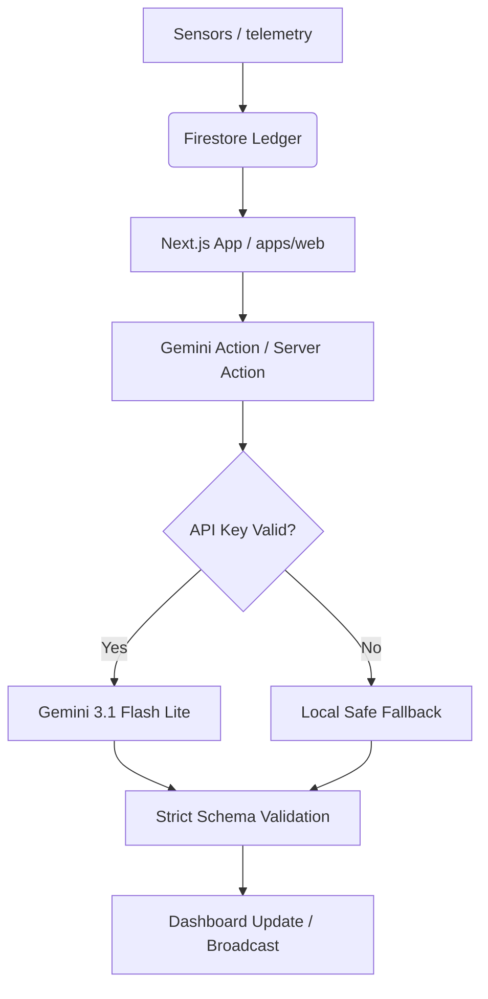

# MatchDay Co-Pilot: FIFA World Cup 2026 Operations
### 🏆 Google Prompt Wars Virtual Challenge 4 Submission

A professional, light-theme web application designed to help stadium operations teams monitor crowd telemetry, generate safety directives using Gemini AI, coordinate volunteers, and log incidents.

---

### 1. What problem does this solve?
During major matches (like the FIFA World Cup 2026), up to 90,000 fans pack a stadium. This leads to congested gates, bottlenecked walkways, and immediate cellular/network failure. Stadium managers need a fast, reliable, offline-capable tool to digest sensory alerts and send simple instructions to on-site volunteer groups who are guiding the crowd.

### 2. Who uses it?
* **Operations Managers (Command Deck):** To watch crowd sensors, review AI-generated instructions, and dispatch redirection updates.
* **On-Site Volunteers / Ushers:** To receive translated announcement scripts and guide fans safely through open routes.

### 3. What does the app do end to end?
The application drives a single, continuous operational cycle:
1. **Telemetry Intake:** The system listens to live data from gate sensors (crowd density, sound decibels, coordinates).
2. **AI Directives:** Gemini evaluates the telemetry to output a severity score, pedestrian routes, and team tasks.
3. **Operator Review & Acknowledgment:** The coordinator reviews the action plan and swipes to authorize the broadcast.
4. **Multilingual Scripts:** The UI generates pre-translated announcement scripts (English, Spanish, Portuguese) matching the issue location. A **dynamic zone selector dropdown** allows volunteers to tailor scripts to specific stadium sectors in real-time.
5. **Real-time Diagnostics:** Integrates a **Microphone Crowd Analyzer Widget** visualizing auditory peak levels (decibels) to alert stewards of unsafe crowd noise thresholds.
6. **Incident Reporting:** Operators log details of crowd flow or equipment issues directly to Firestore.
7. **Shift Off-Ramp:** The volunteer ends their shift, which wipes local security tokens and browser state cleanly.

### 4. Why is the AI needed?
Sensors only provide raw numbers (e.g., `Density: 92%`). AI is required to translate these numbers, along with descriptive logs (e.g., `"Gate C turnstiles lost power"`), into actionable, clear directives. It writes redirection plans and pre-translated scripts instantly, saving precious minutes during crowd surges.

### 5. How is the system safe and reliable?
* **Server-Side API Isolation:** All Gemini API credentials remain isolated on the server, avoiding client-side exposure.
* **Anti-Injection Redaction:** Telemetry text fields are automatically filtered and sanitized against malicious database injection keywords and prompt override attempts.
* **Strict Schema Verification:** If the AI model returns incomplete or malformed JSON, a validator rejects it and switches to a safe, pre-configured local fallback.
* **Identity Audit Guard:** A central identity helper ensures every database write carries a valid identifier (Google email, display name, or UID prefix), ensuring audit records are never blank.
* **Accessibility Standards:** Full keyboard and screen-reader support, including `role="tablist"`, `role="tab"`, focus borders (Outfit font, warm colors), and keyboard interaction controls.

### 6. What is the architecture?
The project is built as a monorepo structured with `pnpm`:
* **`apps/web`:** Next.js frontend with Firebase integration.
* **`packages/core`:** Shared library housing schemas, types, and the Gemini service wrapper.



### 7. What is the tech stack?
* **Framework:** Next.js 16 (App Router)
* **Database & Auth:** Cloud Firestore, Firebase Authentication
* **Artificial Intelligence:** Google GenAI SDK (`gemini-3.1-flash-lite`)
* **Styling:** Tailwind CSS with a consistent light-theme palette
* **Test Suite:** Native Node.js test runner (`node --test`)

### 8. What edge cases are handled?
* **Invalid telemetry coordinates:** Out-of-bounds inputs are automatically clamped to the stadium limits.
* **Bad AI API responses:** Malformed JSON results trigger safety fallbacks.
* **Missing operator details:** The identity helper resolves display name or UID to prevent `null` credentials.
* **Offline states:** Container bounds are preserved to prevent page shifting during connection lag.
* **Race conditions & render loops:** State updates are lazily initialized and deferred using `setTimeout` to prevent React synchronous state updates during rendering.

### 9. How to run it locally?

1. Install dependencies from the root directory:
   ```bash
   pnpm install
   ```

2. Create an `.env.local` file inside `apps/web/` with your credentials:
   ```env
   NEXT_PUBLIC_FIREBASE_API_KEY="your-api-key"
   NEXT_PUBLIC_FIREBASE_AUTH_DOMAIN="your-project.firebaseapp.com"
   NEXT_PUBLIC_FIREBASE_PROJECT_ID="your-project"
   NEXT_PUBLIC_FIREBASE_STORAGE_BUCKET="your-project.appspot.com"
   NEXT_PUBLIC_FIREBASE_MESSAGING_SENDER_ID="your-sender-id"
   NEXT_PUBLIC_FIREBASE_APP_ID="your-app-id"
   GEMINI_API_KEY="your-gemini-studio-key"
   ```

3. Run the development environment:
   ```bash
   pnpm dev
   ```

4. Build and compile the core library (prerequisite for tests):
   ```bash
   pnpm --filter @fifa/core build
   ```

5. Run the test suite:
   ```bash
   pnpm test
   ```

6. Run code quality checks:
   ```bash
   pnpm lint
   pnpm typecheck
   ```

7. Open the application:
   Navigate to `http://localhost:3000`

### 10. What makes it ready for judging?
* **Chosen Vertical:** [Challenge 4] Smart Stadiums & Tournament Operations (targeting stadium volunteers and operations staff).
* **Clean Visual Hierarchy:** Adheres to a neat light-mode design with warm accents, Outfit fonts, and clear focus states.
* **No Code Duplication:** Isolated clean exports, removing unused SDK loops.
* **Comprehensive Test Suite:** High coverage on sanitizers, input filters, and identity mapping with 15 custom tests (1 main suite containing 14 subtests).
* **End-to-End Flow:** One functional loop from intake to off-ramp.
